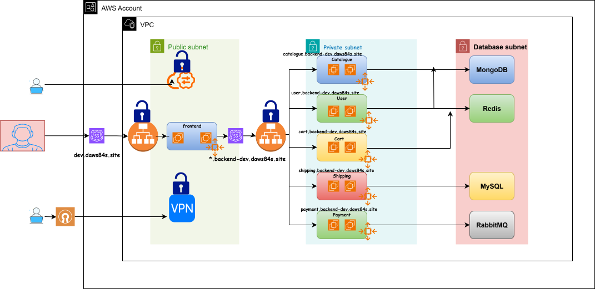

# Here is the list projects included for this project.
```
5.16.terraform-aws-vpc-roboshop
5.17.terraform-aws-securitygroup-roboshop
5.18.ansible-roboshop-roles-tf
5.19.terraform-aws-roboshop-app
5.20.roboshop-infra-dev-tf
```
# How to remove unnecessary files:
```
for d in 00-vpc/ 10-sg/ 20-bastion/ 30-vpn/ 40-databases/ 50-backend-alb/   60-acm/ 70-catalogue/ 80-frontend-alb/ 90-user/ 100-components/ 110-cdn/  ; do
  echo "Removing from $d:"
  echo "  $d/.terraform"
  echo "  $d/.terraform.lock.hcl"

  rm -rf "$d/.terraform" "$d/.terraform.lock.hcl"

  echo "Deleted files from $d"
done
```

# Roboshop VM Architecture



```
for i in 00-vpc/ 10-sg/ 20-bastion/ 30-vpn/ 40-databases/ 50-backend-alb/ 60-acm/ 70-catalogue/ 80-frontend-alb/ 90-user/ 100-components/ 110-cdn ; do cd $i; terraform init ; cd .. ; done 
```

```
for i in 00-vpc/ 10-sg/ 20-bastion/ 30-vpn/ 40-databases/ 50-backend-alb/ 60-acm/ 70-catalogue/ 80-frontend-alb/ 90-user/ 100-components/ 110-cdn ; do cd $i; terraform plan; cd .. ; done 
```


```
for i in 00-vpc/ 10-sg/ 20-bastion/ 30-vpn/; do cd $i; terraform apply -auto-approve; cd .. ; done 
```


```
for i in 00-vpc/ 10-sg/ 20-bastion/ 30-vpn/ 40-databases/ 50-backend-alb/ 60-acm/ 70-catalogue/ 80-frontend-alb/ 90-user/ 100-components/ 110-cdn ; do cd $i; terraform apply -auto-approve; cd .. ; done 
```

```
for i in  110-cdn/ 100-components/ 90-user/ 80-frontend-alb/ 70-catalogue/ 60-acm/ 50-backend-alb/ 40-databases/ 30-vpn/ 20-bastion/ 10-sg/ 00-vpc/ ; do cd $i; terraform destroy -auto-approve; cd .. ; done 
```